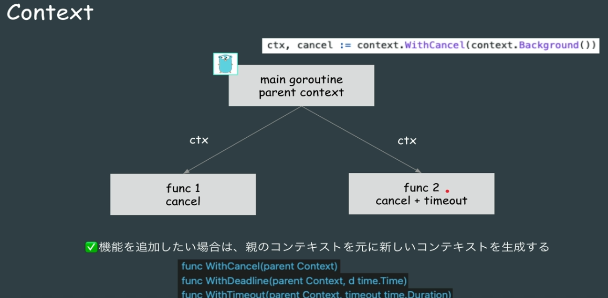
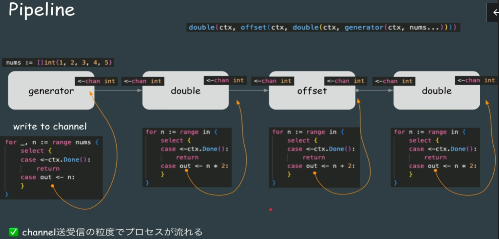

- goはモジュール単位でプロジェクトを作ることができる。

- 外部パッケージをインストールする場合は、go to tidyを使用。

- ポインタ変数：明日変数の先頭のアドレスを値として持っている。必ず型を指定して宣言する。

- チャネルを使用することで複数のgoroutine(go funcで定義)間でデータを送受信できるようになる

- コンテキストの一番の用途は、メインルーチンからサブゴルーチンを一斉にキャンセル

